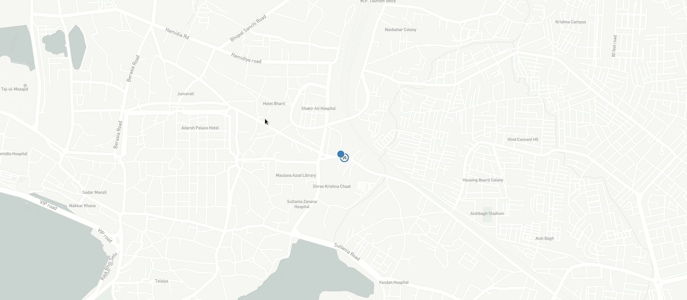

Smart Bhopal Hackathon

This project is a part of Smart Bhopal Hackathon.
It uses MapBox Api to optimize the path of the waste collection vehicles based on the input given by the smart bins, this is just the project initialization, actual implementation includes ml models served as api via Flask framework and a complex set of optimization algorithims.

The live demo of this project can be seen at https://devabhi.tech/sbh
